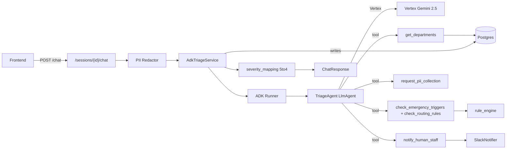

# ADK Migration Plan — Hospital Hotline Triage

## 1. Goal

Replace the bespoke Vertex AI prompt-and-parse flow in `app/services/google_ai.py` with a Google ADK (Agent Development Kit) agent backed by the same Vertex models, while:

- Keeping the FastAPI surface (`/sessions/{id}/chat`, `/stt`, `/tts`) and the `ChatResponse` contract unchanged for the frontend.
- Reusing `GoogleSttClient`, `GoogleTtsClient`, `rule_engine.py`, and `SlackNotifier` as-is (wrapped into ADK tools where appropriate).
- Using the product owner's five-level triage JSON (`app/data/er_triage_five_level_system.json`) as the source of truth for severity.
- Enforcing the privacy rule: patient PII (name, phone, address, ID numbers, email) never reaches the LLM. Level 1 (Red) emergencies trigger a secure PII handoff outside the model.

## 2. Current state (relevant files only)

- Triage entry point: `/sessions/{session_id}/chat` in [`app/main.py`](app/main.py) calls `TriageService.process_chat`.
- Orchestrator: [`app/services/triage_service.py`](app/services/triage_service.py) — runs rule engine, calls `GoogleTriageClient`, persists symptoms / assessments / emergency events / follow-ups, fires Slack.
- LLM wrapper: [`app/services/google_ai.py`](app/services/google_ai.py) — direct `google.genai` JSON-mode prompt; 4-bucket severity (`emergency|urgent|general|unknown`).
- Voice / speech: [`app/services/google_stt.py`](app/services/google_stt.py), [`app/services/google_tts.py`](app/services/google_tts.py) — independent of LLM, keep verbatim.
- Rules: [`app/services/rule_engine.py`](app/services/rule_engine.py) — keyword + `condition_json` matcher.
- Alerts: [`app/services/slack_notifier.py`](app/services/slack_notifier.py).
- Frontend contract: `ChatResponse` in [`app/schemas.py`](app/schemas.py).

Mismatch to resolve: the existing severity enum is 4 buckets, but the canonical schema is 5 levels (Red/Orange/Yellow/Green/Blue). The agent will return level 1–5; we map to the existing enum for the DB / frontend contract and store the raw level + color in metadata.

## 3. Target architecture



Key invariants:
- Every user `content` flowing into the ADK Runner first passes through `pii_redactor`.
- The agent's `reply` field is allow-listed at the output schema; PII regex match in the model output triggers a re-prompt or fallback.
- `notify_human_staff` and `request_pii_collection` are server-side tools — they read `session_id` from the runner context, not from the LLM.

## 4. New folders / files to add

```
hospital-hotline-assistant-api/
  app/
    agents/
      __init__.py
      triage_agent.py          # ADK LlmAgent: instructions, tools, output schema
      severity_mapping.py      # 5-level <-> 4-bucket bridge, color helpers
      pii_redactor.py          # regex scrubbing + tests
      schemas.py               # Pydantic models for the agent's structured output (5-level)
      tools/
        __init__.py
        department_tool.py     # get_departments(connection) for the agent
        rule_tools.py          # check_emergency_triggers / check_routing_rules
        pii_tools.py           # request_pii_collection (side-channel handoff)
        alert_tools.py         # notify_human_staff wrapping SlackNotifier
    services/
      triage_agent_service.py  # new orchestrator: PII redact -> ADK run -> persist
  tests/
    agents/
      test_pii_redactor.py
      test_severity_mapping.py
      test_triage_agent.py     # uses ADK in-memory runner + fake Vertex
    contracts/
      test_chat_response_contract.py
```

## 5. Existing files to keep unchanged

- `app/services/google_stt.py`, `app/services/google_tts.py` — speech I/O is orthogonal.
- `app/services/slack_notifier.py` — called by `alert_tools.py`.
- `app/services/rule_engine.py` — called by `rule_tools.py`.
- `app/data/er_triage_five_level_system.json` — loaded by the agent as the canonical severity schema.
- `app/data/departments.json` — fallback when DB is empty.
- `app/database.py`.
- `app/schemas.py` — `ChatRequest` / `ChatResponse` shape must stay stable for the frontend.
- All `/stt`, `/tts`, `/sessions`, `/messages`, `/admin` endpoints in `app/main.py` — only the wired-in service changes.

## 6. Existing files to refactor

- [`app/services/__init__.py`](app/services/__init__.py) — export both `TriageService` (legacy) and `AdkTriageService`; let callers pick.
- [`app/services/triage_service.py`](app/services/triage_service.py) — extract the DB-load / DB-persist blocks (departments fetch, history fetch, symptom-entry insert, severity-assessment insert, emergency-event insert, follow-up insert, session metadata update) into `triage_persistence.py` helpers used by **both** legacy and ADK orchestrators. Do not delete the legacy orchestrator yet — it is the rollback path.
- [`app/services/google_ai.py`](app/services/google_ai.py) — keep, mark as legacy in module docstring. Used only when `triage_strategy=legacy`.
- [`app/config.py`](app/config.py) — add:
  - `triage_strategy: Literal["adk","legacy"] = "adk"`
  - `pii_redaction_enabled: bool = True`
  - `adk_max_tool_iterations: int = 6`
  - `adk_agent_temperature: float = 0.2`
  - `adk_voice_thinking_budget: int = 0` (mirrors existing voice latency knob)
- [`app/main.py`](app/main.py) — in `lifespan`, instantiate `AdkTriageService` when `settings.triage_strategy == "adk"`, fall back to `TriageService` otherwise. The `/chat` handler stays identical; both services expose the same `process_chat(...)` signature and return shape.
- [`pyproject.toml`](pyproject.toml) — add `google-adk>=1.0.0` (pin minor once we choose the version) under `dependencies`. Keep `google-genai` because ADK uses it as the underlying SDK.

## 7. Severity mapping (5 ↔ 4)

`severity_mapping.py` exposes:

| ADK level | Color  | DB severity (existing enum) | Alerting       |
|-----------|--------|-----------------------------|----------------|
| 1         | Red    | `emergency`                 | Slack + PII handoff |
| 2         | Orange | `emergency`                 | Slack          |
| 3         | Yellow | `urgent`                    | No (default)   |
| 4         | Green  | `general`                   | No             |
| 5         | Blue   | `general`                   | No             |

The raw integer level and color are persisted into:
- `severity_assessments.detected_triggers` (JSONB) — append `{"triage_level": 2, "triage_color": "Orange"}`.
- `sessions.metadata` — set `triage_level`, `triage_color` for fast admin filtering. No DB schema change required.

## 8. PII handling

- `pii_redactor.scrub(text) -> (text_scrubbed, found_kinds: set[str])` — regex over phone numbers (TH + intl), email, Thai 13-digit national ID, generic 7+ digit IDs, and a small name-marker dictionary ("ชื่อ", "name is", etc.). Replacement token is `[REDACTED:<kind>]`.
- Every `content` field is scrubbed **before** entering the ADK Runner. The DB still stores the original `content` (auditable) but the LLM only ever sees the scrubbed copy.
- `request_pii_collection(reason: str)` is a no-input tool from the model's view: it doesn't accept PII as args. Server-side, it sets `sessions.metadata.pii_handoff = {requested_at, reason, status: "pending"}` and emits a Slack alert with handoff instructions for staff. The agent's reply for Level 1 follows a fixed template ("This sounds like an emergency. Stay where you are; a staff member will speak with you directly to take down your details.") — no PII echoes possible.
- Output guard: after the agent returns, run `pii_redactor.scrub` on `reply` too; if redaction fires, replace `reply` with the safe template and log a "pii_in_model_output" event.
- Test fixtures: a small suite of phone/email/ID strings (positive cases) plus medical-numeric edges like "BP 120/80", "took 500 mg" (negative cases) to prevent false positives.

## 9. Migration order

1. **Branch + deps** — already on `feat/google-adk-agent`. Add `google-adk` to `pyproject.toml`; `uv sync` / `pip install -e .` locally to confirm ADK imports.
2. **Schema layer** — write `agents/schemas.py` with the five-level Pydantic models and `agents/severity_mapping.py`. Pure functions, fully unit-testable.
3. **PII redactor** — write `agents/pii_redactor.py` + tests. No dependencies on ADK; can ship and be used by legacy path immediately as a defense-in-depth gain.
4. **Tools** — write `agents/tools/*` against ADK's tool API. Each tool is a thin wrapper around existing services; no new business logic.
5. **Agent** — write `agents/triage_agent.py`: ADK `LlmAgent` (or equivalent) wired to Vertex (`vertexai=True`, `project`, `location`, `model=settings.google_model_name`), tool list, instructions (including the five-level table from the JSON), structured output schema, voice-mode `thinking_budget` toggle.
6. **Orchestrator** — write `services/triage_agent_service.py` with the same `process_chat` signature as `TriageService` and the same return tuple. Internally: load context → redact → run agent → map 5→4 → persist (reusing extracted persistence helpers) → Slack → return.
7. **Wire flag** — refactor `app/main.py` lifespan to pick the service by `settings.triage_strategy`. Default to `adk` only after step 8 passes.
8. **Tests** — unit + contract tests pass with `triage_strategy=adk` against a fake Vertex (ADK in-memory runner or stubbed `LlmAgent.run_async`).
9. **Manual demo run** — backend + frontend end-to-end with a few Thai/EN cases and one Level 1 case to exercise the PII handoff + Slack alert.
10. **Documentation** — update `README.md` with the new env vars and the strategy flag; add an "ADK Agent" section.
11. **Optional follow-ups** (out of scope here) — DB migration to widen the `severity` enum to five levels, ADK session memory across turns, richer tool set (e.g. department-specific FAQ retrieval).

## 10. Risks

- **ADK SDK churn** — Google ADK Python is young; pin a known-good minor version and isolate ADK imports behind `agents/triage_agent.py` so an SDK rev is a single-file change.
- **Latency budget** — ADK adds tool-call hops. Voice mode currently caps `max_output_tokens=384` and disables thinking. Mirror both in the agent config; benchmark voice round-trip after migration and roll back via flag if > 2× legacy median.
- **PII regex false positives / negatives** — vital signs and dosages overlap with phone-number patterns. Mitigate with the negative-case test suite and the output guard. Defense in depth: the model cannot leak what it never saw.
- **Severity mapping loss** — collapsing 5 → 4 hides Yellow vs Green nuance from the existing UI. We store the raw level/color in metadata so admin can read both, and a future UI tick can expose the full ladder.
- **Tool-result hallucination** — ADK lets the model call tools, but it can still ignore tool outputs. Enforce: if `check_emergency_triggers` returns a hit, the orchestrator forces severity = Level 1/2 regardless of the model's claim (same precedence logic the legacy `TriageService` already implements at lines 131–141).
- **DB writes during a partially-failed agent run** — wrap the persistence block in a single transaction so an ADK timeout doesn't leave half-written rows; current legacy flow already does this implicitly via the per-request connection — preserve that.
- **Cost** — ADK still bills Vertex per call; no change in token volume budget. Tool-call iterations are capped by `adk_max_tool_iterations` to bound worst-case cost.

## 11. Testing strategy

Unit:
- `tests/agents/test_pii_redactor.py` — positive (phones, emails, 13-digit Thai ID, names with markers) and negative (medical numerics, dates, dosages).
- `tests/agents/test_severity_mapping.py` — every level → bucket, every color string, unknown / invalid input.
- `tests/agents/test_triage_agent.py` — stub the LLM call inside ADK; assert tools are invoked in the expected order on a synthetic chest-pain message and a synthetic Level 1 message.

Contract:
- `tests/contracts/test_chat_response_contract.py` — run the `/chat` endpoint against an in-memory FastAPI test client with both `triage_strategy=adk` (mocked agent) and `triage_strategy=legacy` (mocked Vertex), asserting the JSON body of `ChatResponse` matches the same schema in both modes. This is the single most important guard for the frontend.

Integration (manual, demo-time):
- Chat: "I have severe chest pain" (EN) → expect Level 2 → DB severity `emergency`, Slack fired.
- Voice: same input via STT → same outcome, latency comparable to legacy.
- PII: "My name is Anya, phone 0812345678, my chest hurts" → LLM sees redacted text; DB stores raw; reply contains no leaked PII.
- Level 1: "He's not breathing" → `request_pii_collection` invoked exactly once, fixed-template reply, Slack contains the handoff instruction.
- Fallback: temporarily set `triage_strategy=legacy` and re-run the same suite; the frontend must behave identically.

Rollback:
- `triage_strategy=legacy` in `.env` reverts to the existing `TriageService` path without any code change.

## 12. Env vars added

```
TRIAGE_STRATEGY=adk            # adk | legacy
PII_REDACTION_ENABLED=true
ADK_MAX_TOOL_ITERATIONS=6
ADK_AGENT_TEMPERATURE=0.2
ADK_VOICE_THINKING_BUDGET=0
```

Existing `GOOGLE_CLOUD_PROJECT`, `GOOGLE_CLOUD_LOCATION`, `GOOGLE_MODEL_NAME`, `GOOGLE_APPLICATION_CREDENTIALS`, `GOOGLE_AI_ENABLED` keep their current meaning.
